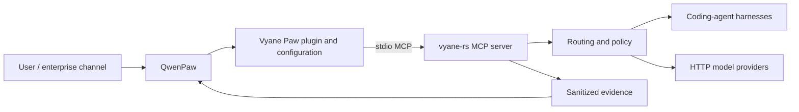

# Vyane Paw

Vyane Paw is the private integration and productization layer between
[QwenPaw](https://github.com/agentscope-ai/QwenPaw) and
[vyane-rs](https://github.com/zleo-ai/vyane-rs). It turns "a QwenPaw agent
calling Vyane's multi-model execution" into a supported, policy-bounded,
evidence-backed product path instead of ad-hoc glue.

QwenPaw keeps what it owns — conversations, channels, agent workspace, memory,
and the plugin host. Vyane keeps what it owns — model routing, dispatch,
broadcast review, failover, and durable workflow execution. Vyane Paw owns the
seam between them: a QwenPaw plugin, safe configuration examples, compatibility
gates, and the contracts that keep every product claim testable.

## Why this shape

- **Not a fork, not a reimplementation.** The repository contains no copies of
  either upstream runtime; it prefers configuration and thin adapters, and it
  pins exact upstream revisions instead of claiming compatibility from version
  ranges.
- **Local stdio MCP, no gateway in phase one.** QwenPaw launches
  `vyane --config <file> mcp` as a local stdio MCP server through the
  `vyane-paw-mcp` launcher. A permanent gateway is deferred until remote
  hosting, multi-tenant isolation, an enterprise authentication boundary, or
  protocol translation actually requires one (see `docs/ARCHITECTURE.md`).
- **Policy-bounded by construction.** The plugin never executes subprocesses
  and never mutates QwenPaw configuration. A deployment-owned JSON policy
  (`VYANE_PAW_POLICY`) decides which tools, targets, and modes are authorized;
  with no policy configured, only a restricted route/dispatch default is
  available.
- **Evidence-driven claims.** Every verified capability below is reproducible
  through its gate script; the stable-lane rows additionally link to
  committed, schema-validated evidence.

## Architecture in brief



The full ownership table, the durable-workflow control path, and the gateway
criteria are in [docs/ARCHITECTURE.md](docs/ARCHITECTURE.md).

## Quick start (shape)

All names and paths below are placeholders; credentials and real deployment
values never enter this repository.

1. Check the pinned upstream revisions in `upstreams.lock.json`. Compatibility
   is claimed only at those exact revisions.
2. Prepare a Vyane configuration from
   `config/examples/vyane.example.toml` and store it outside the repository.
3. Install the QwenPaw plugin while QwenPaw is offline:

   ```bash
   qwenpaw plugin install /path/to/vyane-paw/qwenpaw-plugin
   ```

4. Import the MCP client configuration from
   `config/examples/qwenpaw-mcp.example.json` in the QwenPaw Console, setting
   `VYANE_PAW_CONFIG` to your Vyane TOML file (and optionally
   `VYANE_PAW_VYANE_BIN` if `vyane` is not on `PATH`).
5. Optionally provide a deployment policy through `VYANE_PAW_POLICY` to enable
   failover, review, and durable workflow modes for allowlisted targets.
6. Try `/vyane route <task>` for a deterministic routing preview, then
   `/vyane dispatch <task>`.

The plugin registers the `/vyane` command with seven product modes — `route`,
`dispatch`, `failover`, `review`, and durable `workflow-submit`,
`workflow-status`, `workflow-cancel`. Selector values are deployment profile
names, never raw provider/model strings. Details are in
[qwenpaw-plugin/README.md](qwenpaw-plugin/README.md).

## Verified capabilities

Each row is reproducible through its gate script against the pinned
revisions.

| Capability | Package | Evidence | Gate |
| --- | --- | --- | --- |
| Pinned stdio MCP compatibility (9-tool surface, error codes, clean shutdown) | VP-01 | `evidence/vp01-baseline.json` | `scripts/run-vp01.sh` |
| Synthetic route, failover, timeout, cancellation-gap, and broadcast flows | VP-02 | `evidence/vp02-*.json` | `scripts/run-vp02.sh` |
| Policy-bounded plugin and launcher product entry | VP-03 | `evidence/vp03-product-entry.json` | `scripts/run-vp03.sh` |
| Moving-candidate compatibility canary (advisory) | VP-06 | runtime evidence | `scripts/run-vp06.sh` |
| Real pinned headless QwenPaw application integration | VP-07 | runtime evidence | `scripts/run-vp07.sh` |
| Durable workflow submit/status/cancel lifecycle | VP-08 | runtime evidence | `scripts/run-vp08.sh` |
| MCP capability-negotiation probe (advertised/negotiated/claimed) | VP-09 | `evidence/vp09-capabilities.json` | `scripts/run-vp09.sh` |
| Stable upstream lock promotion process | VP-10 | this ledger | `work-packages/VP-10.md` |

VP-04 (competition material) and VP-05 (installation/packaging) are
deliberately deferred; the full ledger is in
[docs/STATUS.md](docs/STATUS.md).

## What Vyane Paw does not claim

- **No MCP Tasks support.** The VP-09 probe recorded that neither pinned
  endpoint advertises `tasks`; a claim requires both pinned endpoints to
  negotiate and pass it first.
- **No `server/discover`, no Streamable HTTP, no stateless handling.** The
  probe recorded method-not-found for discovery at the pinned revisions;
  transport work needs an architecture decision.
- **No server-side cancellation from stopping a chat turn.** Request-bound
  modes keep finite execution timeouts. Explicit cancellation exists only
  through the durable workflow tools, which are a custom Vyane lifecycle, not
  MCP request cancellation.
- **No remote gateway, multi-tenancy, or centralized policy.** The local
  resident daemon used by durable workflows does not change that.
- **No compatibility claims beyond the pinned revisions.** The moving
  candidate lane is advisory and never rewrites the last proven stable claim.

## Current baseline

- Product name: **Vyane Paw**; repository `vyane-paw`; visibility: private
- QwenPaw `ebb5b24d0b2559af51d71a38547d88d384357a64`
- `vyane-rs` `319b9da521e3242b482dff46cf92f676b5f38686`
- `rmcp` `3.0.1`

## Repository map

- `docs/ARCHITECTURE.md` — system boundaries and target architecture
- `docs/STATUS.md` — current work-package ledger, deferred scope, and
  context-free continuation procedure
- `docs/MCP-COMPATIBILITY.md` — protocol baseline and validation matrix
- `docs/COMPETITION-PLAN.md` — delivery milestones through the initial and final
  submissions
- `docs/DEMO-SCENARIOS.md` — the product stories to demonstrate
- `docs/SECURITY.md` — data, credential, and evidence handling
- `docs/decisions/` — architecture decisions
- `work-packages/` — executable work definitions
- `config/examples/` — synthetic configuration examples
- `schemas/` — sanitized policy and evidence contracts
- `upstreams.lock.json` — exact upstream revisions used by the compatibility gate

See [README.zh-CN.md](README.zh-CN.md) for the Chinese overview.
