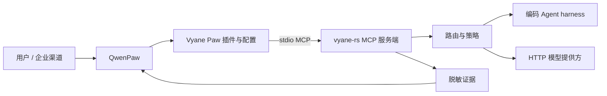

# Vyane Paw

Vyane Paw 是连接
[QwenPaw](https://github.com/agentscope-ai/QwenPaw) 与
[vyane-rs](https://github.com/zleo-ai/vyane-rs) 的私有集成与产品化仓。它把
"QwenPaw 调用 Vyane 的多模型执行能力"做成一条有产品形态、受策略约束、
有证据背书的路径，而不是临时胶水。

QwenPaw 继续负责它该负责的：对话、渠道、Agent 工作区、记忆和插件承载；
Vyane 继续负责它该负责的：多模型路由、任务分发、广播评审、失败切换与
持久工作流执行。Vyane Paw 负责两者之间的接缝：QwenPaw 插件、安全示例
配置、兼容性门禁，以及让每一条产品声称都可复验的契约。

## 为什么是这个形态

- **不是 fork，也不是重写。** 仓内不复制任何上游运行时代码，只用配置和
  薄适配层；兼容性只钉精确上游 revision，不靠版本区间声称。
- **本机 stdio MCP，一期不建网关。** QwenPaw 经 `vyane-paw-mcp` launcher
  拉起 `vyane --config <文件> mcp` 作为本地 stdio MCP 服务端。只有出现
  远程部署、多租户隔离、企业鉴权边界或协议转换需求时才另立网关（见
  `docs/ARCHITECTURE.md`）。
- **策略约束是内建的。** 插件自身不执行子进程、不修改 QwenPaw 配置。
  部署方持有的 JSON 策略（`VYANE_PAW_POLICY`）决定哪些工具、目标和模式
  被授权；没有配置策略时只有受限的 route/dispatch 默认面。
- **声称必须带证据。** 下方每一条已验证能力都可以经门禁脚本复现；stable
  道的行还附有提交的、经过 schema 校验的证据。

## 架构一瞥



完整的职责边界、持久工作流控制路径和网关触发条件见
[docs/ARCHITECTURE.md](docs/ARCHITECTURE.md)。

## 快速上手（形状）

以下名称与路径均为占位；凭据与真实部署信息永不进入本仓。

1. 先核对 `upstreams.lock.json` 里的钉版 revision——兼容性只在这些精确
   revision 上声称。
2. 参考 `config/examples/vyane.example.toml` 准备一份 Vyane 配置，存放在
   仓库之外。
3. 在 QwenPaw 离线状态下安装插件：

   ```bash
   qwenpaw plugin install /path/to/vyane-paw/qwenpaw-plugin
   ```

4. 在 QwenPaw Console 导入
   `config/examples/qwenpaw-mcp.example.json` 中的 MCP 客户端配置，把
   `VYANE_PAW_CONFIG` 指向你的 Vyane TOML 文件（`vyane` 不在 `PATH` 上时
   另设 `VYANE_PAW_VYANE_BIN`）。
5. 需要失败切换、并行评审和持久工作流模式时，由部署方经
   `VYANE_PAW_POLICY` 下发授权策略并放行目标 profile。
6. 先 `/vyane route <任务>` 看确定性路由预览，再 `/vyane dispatch <任务>`。

插件注册一个 `/vyane` 命令、共七种产品模式：`route`、`dispatch`、
`failover`、`review`，以及持久的 `workflow-submit`、`workflow-status`、
`workflow-cancel`。选择器只接受部署方 profile 名，不接受裸
provider/model 字符串。详见
[qwenpaw-plugin/README.md](qwenpaw-plugin/README.md)。

## 已验证能力

每一行都可以在钉版 revision 上经对应门禁脚本复现。

| 能力 | 工作包 | 证据 | 门禁 |
| --- | --- | --- | --- |
| 钉版 stdio MCP 兼容（九工具面、错误码、干净关停） | VP-01 | `evidence/vp01-baseline.json` | `scripts/run-vp01.sh` |
| 合成路由、失败切换、超时、取消缺口与广播流程 | VP-02 | `evidence/vp02-*.json` | `scripts/run-vp02.sh` |
| 受策略约束的插件与 launcher 产品入口 | VP-03 | `evidence/vp03-product-entry.json` | `scripts/run-vp03.sh` |
| 移动候选兼容性 canary（advisory） | VP-06 | runtime 证据 | `scripts/run-vp06.sh` |
| 真实钉版无头 QwenPaw 应用集成 | VP-07 | runtime 证据 | `scripts/run-vp07.sh` |
| 持久工作流提交/状态/取消生命周期 | VP-08 | runtime 证据 | `scripts/run-vp08.sh` |
| MCP 能力协商探测（advertised/negotiated/claimed 分离） | VP-09 | `evidence/vp09-capabilities.json` | `scripts/run-vp09.sh` |
| stable 上游锁提升流程 | VP-10 | 本台账 | `work-packages/VP-10.md` |

VP-04（竞赛材料）与 VP-05（安装/打包）为有意暂缓项；完整台账见
[docs/STATUS.md](docs/STATUS.md)。

## Vyane Paw 不声称什么

- **不声称 MCP Tasks 支持。** VP-09 探测记录到两个钉版端点都没有
  advertise `tasks`；在两端钉版 revision 协商并通过之前不作此声称。
- **不声称 `server/discover`、Streamable HTTP 或无状态处理。** 探测在钉版
  revision 上记录到 discovery 返回 method-not-found；传输层工作需要架构
  决策先行。
- **不把停止对话回合当作服务端取消。** 请求型模式保留有限执行超时；显式
  取消只存在于持久工作流工具，那是 Vyane 自定义生命周期，不是 MCP 请求
  取消。
- **不声称远程网关、多租户或集中策略。** 持久工作流使用的本地常驻
  daemon 不改变这一点。
- **不在钉版 revision 之外声称兼容。** 移动候选道是 advisory，永不改写
  最近一次已证明的 stable 结论。

## 当前基线

- 产品名：**Vyane Paw**；仓库 `vyane-paw`；可见性：private
- QwenPaw `ebb5b24d0b2559af51d71a38547d88d384357a64`
- `vyane-rs` `319b9da521e3242b482dff46cf92f676b5f38686`
- `rmcp` `3.0.1`

## 仓库地图

- `docs/ARCHITECTURE.md` — 系统边界与目标架构
- `docs/STATUS.md` — 工作包台账、暂缓范围与无上下文续接步骤
- `docs/MCP-COMPATIBILITY.md` — 协议基线与验证矩阵
- `docs/COMPETITION-PLAN.md` — 初赛到决赛的交付里程碑
- `docs/DEMO-SCENARIOS.md` — 待演示的产品故事
- `docs/SECURITY.md` — 数据、凭据与证据处理
- `docs/decisions/` — 架构决策记录
- `work-packages/` — 可执行工作定义
- `config/examples/` — 合成示例配置
- `schemas/` — 脱敏策略与证据契约
- `upstreams.lock.json` — 兼容门禁使用的精确上游 revision

English overview: [README.md](README.md)。
