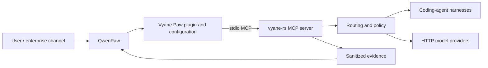

# Architecture

## Positioning

Vyane Paw is an integration product. It packages a supported path from a
QwenPaw agent to Vyane capabilities and turns that path into repeatable product
flows, policy, tests, and evidence.

## Ownership

| Concern | Owner |
| --- | --- |
| Conversation, UI, channels, agent workspace, memory | QwenPaw |
| Plugin manifest, safe defaults, compatibility tests, demo UX | Vyane Paw |
| Provider/protocol/harness/model routing and execution | Vyane |
| Secrets and provider credentials | Deployment environment |
| Sanitized result presentation | Vyane Paw |

## Runtime path

The first runtime path launches `vyane --config <path> mcp` as a local stdio MCP
server from QwenPaw. QwenPaw owns the client lifecycle; Vyane exposes tools. This
uses process isolation and avoids another network listener.

The integration must not parse terminal prose. It should use MCP tool inputs and
structured results only.

## Why no gateway in phase one

Both sides already implement MCP. A gateway would add lifecycle, deployment,
logging, authentication, and failure modes without proving product value. A
gateway becomes justified when at least one of these is accepted:

- QwenPaw and Vyane run on different hosts.
- Multiple users need tenant isolation and centralized policy.
- An enterprise authentication boundary must be enforced.
- Legacy and modern MCP transports require explicit translation.
- Durable asynchronous tasks need a shared control plane.

## Evolution

1. Direct local stdio compatibility.
2. QwenPaw plugin and three product scenarios.
3. Policy, evidence, packaging, and measurable acceptance.
4. Optional remote gateway and MCP 2026-07-28 extensions.
