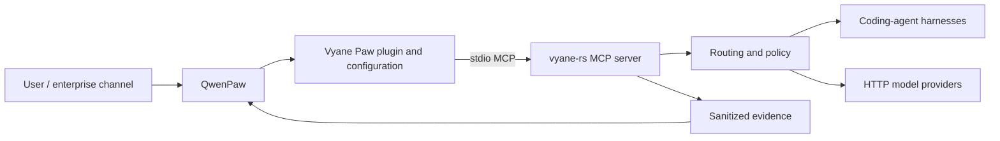

# Architecture

## Positioning

Vyane Paw is an integration product. It packages a supported path from a
QwenPaw agent to Vyane capabilities and turns that path into repeatable product
flows, policy, tests, and evidence.

## Ownership

| Concern | Owner |
| --- | --- |
| Conversation, UI, channels, agent workspace, memory | QwenPaw |
| Plugin manifest, safe defaults, compatibility tests, demo UX | Vyane Paw |
| Provider/protocol/harness/model routing and execution | Vyane |
| Secrets and provider credentials | Deployment environment |
| Sanitized result presentation | Vyane Paw |

## Runtime path

The first runtime path launches `vyane --config <path> mcp` as a local stdio MCP
server from QwenPaw. QwenPaw owns the client lifecycle; Vyane exposes tools. This
uses process isolation and avoids another network listener.

The integration must not parse terminal prose. It should use MCP tool inputs and
structured results only.

## QwenPaw product entry

The first product entry is intentionally split across two supported QwenPaw
extension surfaces:

1. A bundle plugin registers the `/vyane` slash command and the `vyane-paw`
   Skill.
2. A standard `mcpServers` import registers the local stdio MCP DriverCard.

The slash command does not execute a subprocess and does not mutate QwenPaw
configuration. It parses a bounded product mode, injects a current-turn
contract, and lets the QwenPaw agent call the allowlisted Vyane MCP tool.

The MCP client uses the `vyane-paw-mcp` launcher. The launcher resolves the
Vyane executable and configuration from deployment-owned environment variables,
validates them without printing their values, and then replaces itself with
`vyane --config <file> mcp`.

QwenPaw's public plugin API at the pinned revision exposes slash-command and
Skill-provider registration but no MCP DriverCard registration. Keeping the
standard MCP import separate avoids coupling this repository to internal card
storage or application services.

## Durable workflow control

Request-bound route, dispatch, failover, and review calls keep finite execution
timeouts. Stopping the local QwenPaw turn does not prove that its already-issued
server request was cancelled.

Durable work is a separate lifecycle. The plugin calls
`vyane_workflow_submit`, `vyane_workflow_status`, and `vyane_workflow_cancel`
through QwenPaw's governed DriverManager. Submit constructs one fixed,
single-step read-only workflow from a policy-authorized target and the original
user task. Status and cancel use a caller-owned canonical UUIDv7. The model
does not select raw workflow arguments or cancellation targets.

This path uses a local resident Vyane daemon so workflow state can outlive one
chat request. It remains within the local stdio integration boundary and is not
a new network gateway. These custom Vyane tools are also distinct from the MCP
Tasks extension, which is not claimed until both pinned endpoints negotiate and
pass it.

## Why no gateway in phase one

Both sides already implement MCP. A gateway would add lifecycle, deployment,
logging, authentication, and failure modes without proving product value. A
gateway becomes justified when at least one of these is accepted:

- QwenPaw and Vyane run on different hosts.
- Multiple users need tenant isolation and centralized policy.
- An enterprise authentication boundary must be enforced.
- Legacy and modern MCP transports require explicit translation.
- Durable asynchronous tasks need a shared control plane across hosts or
  tenants. A local resident daemon alone is not sufficient justification.

## Evolution

1. Direct local stdio compatibility.
2. Policy-bounded QwenPaw plugin and request-bound product scenarios.
3. Real QwenPaw application validation and explicit local durable workflow
   control.
4. Policy, evidence, packaging, and measurable acceptance as separately scoped
   work.
5. Optional remote gateway and negotiated MCP 2026-07-28 extensions.
